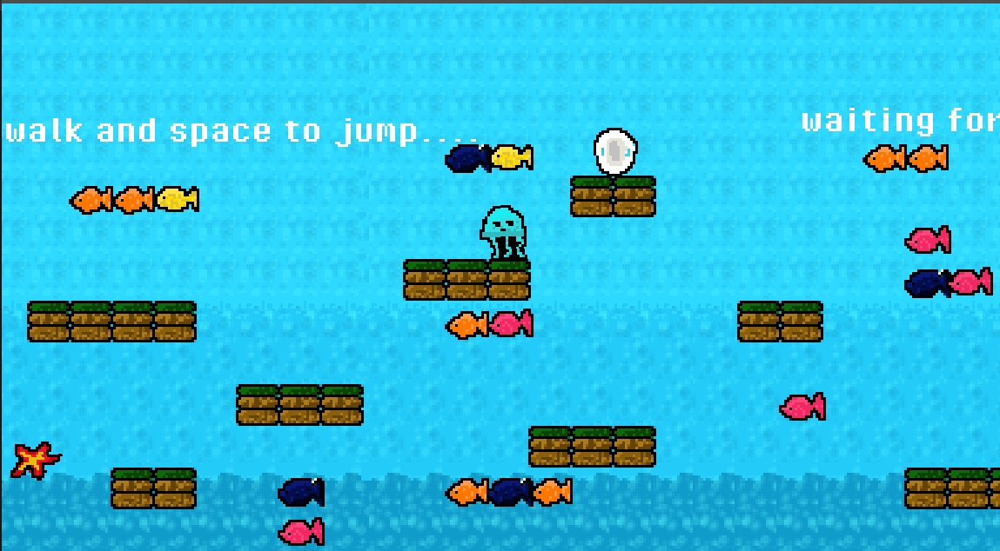
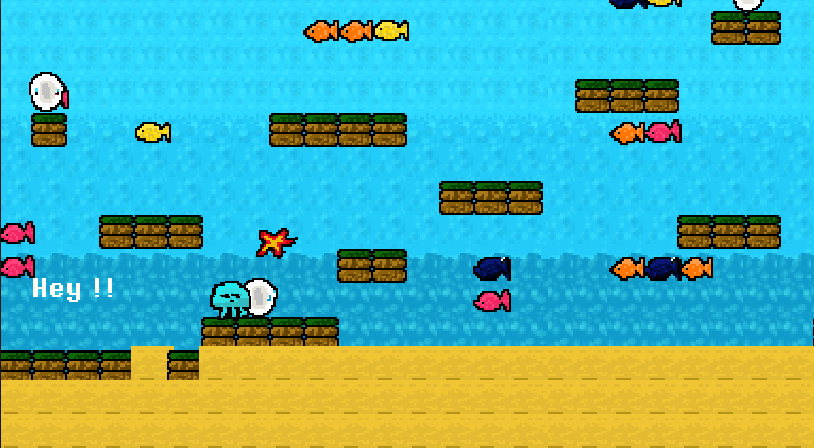
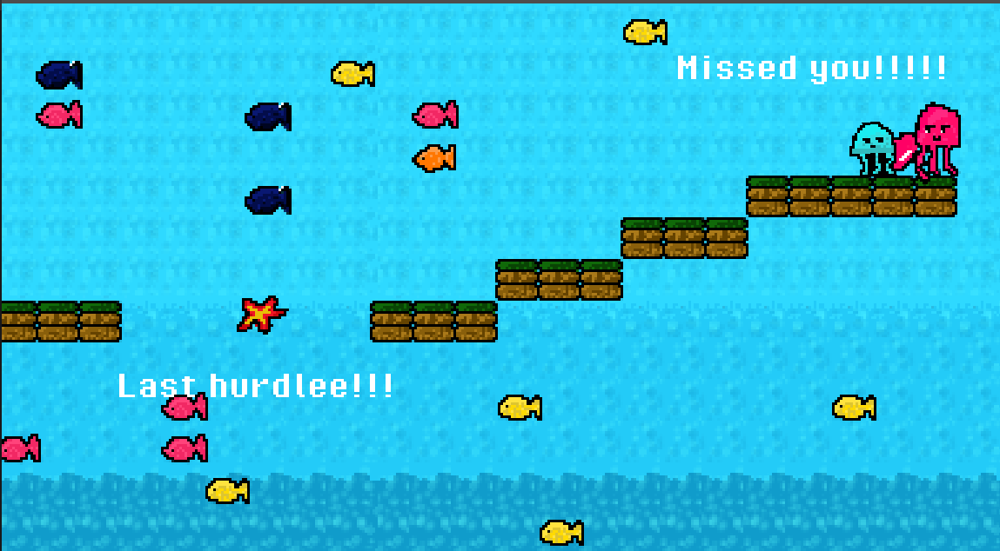

# 🪼 Jellyfish’s Conquest

**Jellyfish’s Conquest** is a small, wholesome 2D platformer where a jellyfish named **Jellie** swims through an underwater world full of moving blocks, curious fishes, and shiny sea pearls — all to reunite with his beloved **Bellie** .

This project is made using **[Godot Engine](https://godotengine.org/)**, with **pixel art** backgrounds and characters handcrafted in **[Krita](https://krita.org/)**.

---

## 🌊 Gameplay Overview

- Play as **Jellie**, a cute jellyfish on a quest to meet Bellie.  
- **Collect sea pearls** scattered through the ocean.  
- **Avoid obstacles and fishes**, some move unpredictably!  
- Reach the **end of the level** to complete Jellie’s journey.

---

## 🎮 Features

- 🧠 Simple yet fun mechanics  
- 🐠 Smooth 2D movement and collision handling  
- 🎨 Original pixel art designed from scratch  
- 🪼 Soothing underwater theme  
- 💙 Entirely built with Godot Engine tools

---

## 🛠️ Built With

| Tool | Purpose |
|------|----------|
| [Godot Engine](https://godotengine.org/) | Game engine |
| [Krita](https://krita.org/) | Pixel art & character design |
| [Git](https://git-scm.com/) / [GitHub](https://github.com/) | Version control & collaboration |

---

## 🚀 How to Run

1. Clone this repository:
   ```bash
   git clone https://github.com/<your-username>/jellyfishs-conquest.git
   cd jellyfishs-conquest
   ```
2. Open the project in **Godot** (`Project → Import → select the project.godot file`).
3. Start playing!

---

## 📸 Screenshots / Gameplay Preview

| Jellie exploring | Collecting sea pearls | Meeting Bellie |
|------------------|-----------------------|----------------|
|  |  |  |


---

## 🧩 Project Structure

```
📂 jellyfishs-conquest/
 ┣ 📂 assets/           # Art, sprites, backgrounds
 ┣ 📂 scenes/           # Godot scene files
 ┣ 📂 scripts/          # GDScript files for gameplay logic        
 ┣ 📜 project.godot     # Main Godot project file
 ┗ 📜 README.md
```
## 📄 License

This project is released under the **MIT License** 
---

> “Even the tiniest jellyfish can light up the ocean.” 🌌

---
